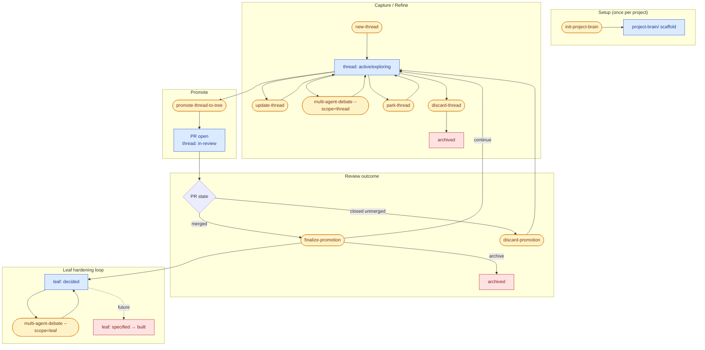
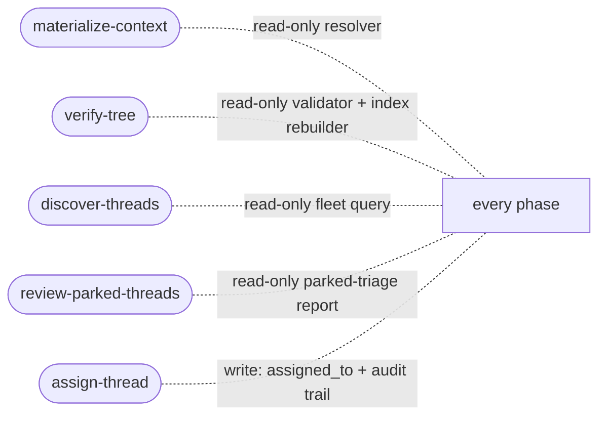
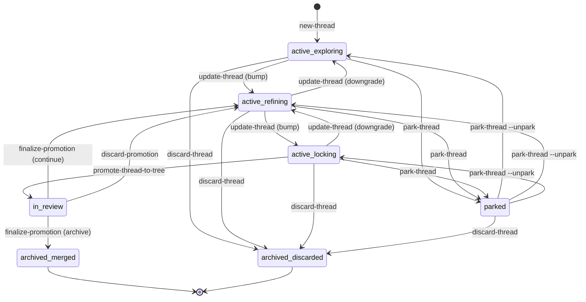
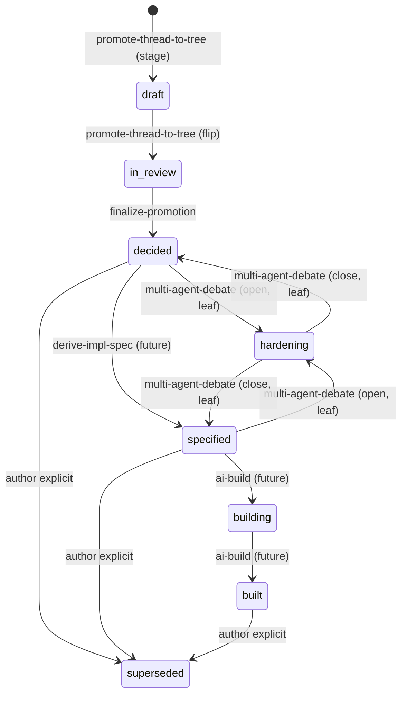

# project-brain

> A portable skill pack that turns unstructured thinking into a durable decision tree.

`project-brain` is a set of fourteen skills that cooperate to move an idea from "I was thinking about X" to a merged, reviewed, auditable decision in your repo. It is deliberately generic — a new project installs the pack, fills in a few slots (domain taxonomy, debate personas, build commands), and gets the full pipeline with no project-specific skill code.

The pack lives in `project-brain/` at your project root — visible, tracked, reviewable via PR. Nothing is hidden under `.ai/` or derived from a database; the tree itself is authoritative.

---

## Table of contents

1. [What the pack does](#what-the-pack-does)
2. [Install](#install)
    - [Install by pointing an AI agent at the repo](#install-by-pointing-an-ai-agent-at-the-repo)
    - [Install manually](#install-manually)
    - [Post-install sanity check](#post-install-sanity-check)
3. [Workflow at a glance](#workflow-at-a-glance)
4. [The fourteen skills](#the-fourteen-skills)
5. [A day in the life](#a-day-in-the-life)
6. [Data model](#data-model)
7. [Cross-cutting: context, validation, and fleet queries](#cross-cutting-context-validation-and-fleet-queries)
8. [Configuration (rc4+)](#configuration-rc4)
9. [Extending the pack](#extending-the-pack)
10. [Runtime portability](#runtime-portability)
11. [Security](#security)
12. [Disclaimer](#disclaimer)
13. [Versioning and status](#versioning-and-status)

---

## What the pack does

The pack owns three artifact kinds and one registry:

- **Thread.** A private workspace for thinking — one folder per topic under `project-brain/threads/<slug>/`. Lives in `active | parked | in-review | archived`.
- **Leaf.** A decision recorded in the shared tree at `project-brain/tree/<domain>/<leaf>.md`. Lives in the chain `draft → in-review → decided → specified → building → built`, with `hardening` as a transient pressure-test state and `superseded` as an orthogonal terminal.
- **NODE.md.** The index file for each tree directory — `decided` forever, no lifecycle of its own.
- **Project registry.** `~/.config/project-brain/projects.yaml` maps aliases to brain roots and remote URLs so skills can resolve `alias:tree/path` URIs without shelling out to `git remote -v`.

Every skill in the pack reads `CONVENTIONS.md` at the brain root as its source of truth. Frontmatter schemas, lifecycle transitions, validator invariants, and naming rules are all defined there. If the schema changes, you change it there first and the skills follow.

---

## Install

If you want to see what the pack does before installing, jump to [QUICKSTART.md](QUICKSTART.md) — it walks through a hiring-decision example end-to-end without requiring you to install anything.

### Install as a Claude Code / Cowork plugin (recommended)

The pack ships as a native Claude plugin. One-time setup per user, then the 14 skills are available in every project you open.

**Claude Code CLI:**

```sh
claude plugin marketplace add taotan-eng/project-brain
claude plugin install project-brain@project-brain
claude plugin list         # confirms project-brain@project-brain is enabled
```

**Claude Cowork (desktop app):** Cowork's in-app plugin browser (Settings → Extensions) currently surfaces only Anthropic- and partner-curated plugins, so `project-brain` isn't searchable there yet. Until the pack is accepted into Anthropic's community directory, Cowork users should install via the Claude Code CLI above (Cowork picks up plugins installed through the CLI on the same machine) or follow the manual procedure below.

Once installed, skip ahead to the first-run scaffold step — the plugin install handles Step 1 + Step 2 of the manual procedure for you. You only need to run `init-project-brain` against your project to get `project-brain/` scaffolded.

### Install by pointing an AI agent at the repo

Copy-paste one of the prompts below into your AI coding assistant (Claude Code, Claude Desktop / Cowork, Codex, Cursor, Gemini CLI, Aider, or any agent that can clone a repo and write files). Replace `<repo-url>` with the pack's GitHub URL.

> **Generic install prompt (any agent).**
>
> Install the `project-brain` skill pack from `<repo-url>` into my current project.
>
> Steps:
>
> 1. `git clone <repo-url> /tmp/project-brain-pack` (or any scratch location).
> 2. Read `/tmp/project-brain-pack/README.md` and `/tmp/project-brain-pack/CONVENTIONS.md` in full.
> 3. Read every `skills/*/SKILL.md` so you know what each skill does.
> 4. Read `/tmp/project-brain-pack/INSTALL.md` for the step-by-step install procedure; it is authoritative if it disagrees with anything you infer.
> 5. Copy the pack contents (`skills/`, `assets/`, `CONVENTIONS.md`, `scripts/`) into the place your agent runtime expects skill packs to live (Claude Code: `.claude/skills/project-brain/`; others: whatever the runtime's skill-pack directory is — ask me if unsure).
> 6. Run `skills/init-project-brain` against my current repo to scaffold `project-brain/`. If your runtime cannot invoke the skill directly, follow the Process section of `skills/init-project-brain/SKILL.md` by hand — it is written as an instruction sheet for exactly this case.
> 7. Report what you scaffolded and what answers you gave to the init prompts (project alias, domain list, etc.) so I can review.
>
> Do not modify any pack file during install. If you find the pack is missing something you need, surface it as a warning; do not patch the pack in place.

> **Claude Code specific prompt.**
>
> Clone `<repo-url>` and install its `project-brain` skill pack. Place it at `.claude/skills/project-brain/` inside my current repo. Read `CONVENTIONS.md` and every `skills/*/SKILL.md` before doing anything else. Then run the `init-project-brain` skill to scaffold `project-brain/` in this project.

> **Codex / Cursor / Gemini CLI / Aider specific prompt.**
>
> Your runtime may or may not have a "skill pack" concept. Treat the SKILL.md files as authoritative instruction sheets. Install path:
>
> 1. Clone `<repo-url>` somewhere on disk.
> 2. Copy `CONVENTIONS.md` to `project-brain/CONVENTIONS.md` in my project (`init-project-brain` expects it there and will refuse without it).
> 3. Copy `skills/`, `assets/`, and `scripts/` to a predictable location (suggested: `project-brain/.pack/`) so the other skills can find their templates and helpers.
> 4. Walk `skills/init-project-brain/SKILL.md` step by step to scaffold the rest.
> 5. Future invocations of any skill = read that skill's SKILL.md, follow its Process section, honor its Preconditions and Postconditions.

### Install manually

If you prefer to install by hand (or your agent lacks repo-clone capability):

```sh
# 1. Clone the pack into a scratch location.
git clone <repo-url> /tmp/project-brain-pack
cd <your-project>

# 2. Copy the pack into your project.
#    Claude Code layout:
mkdir -p .claude/skills
cp -R /tmp/project-brain-pack/skills/*  .claude/skills/
#    CONVENTIONS and scripts land at the brain root once init runs:
mkdir -p thoughts
cp /tmp/project-brain-pack/CONVENTIONS.md project-brain/CONVENTIONS.md
cp -R /tmp/project-brain-pack/assets  project-brain/.pack-assets    # referenced by the skills
cp -R /tmp/project-brain-pack/scripts project-brain/.pack-scripts   # e.g. verify-tree.py

# 3. Verify the skills are discoverable by your runtime.
#    Claude Code:
ls .claude/skills/      # should list init-project-brain, new-thread, ...

# 4. Run init-project-brain. Your runtime invokes skills its own way;
#    from Claude Code, ask it to run `init-project-brain`.
#    From any other runtime, open skills/init-project-brain/SKILL.md
#    and follow the Process section manually.
```

After init runs, your repo gains a `project-brain/` directory with `thread-index.md`, `current-state.md`, `tree/NODE.md`, one `NODE.md` per top-level domain, and an entry in `~/.config/project-brain/projects.yaml`. The bootstrap lands as a single commit on your current branch.

### Post-install sanity check

```sh
# From your project root, inside the brain:
cd thoughts

# Validate the scaffold.
python3 .pack-scripts/verify-tree.py            # should exit 0
# Or, if the skill is directly invokable:
# skill: verify-tree

# Confirm the project alias registered.
cat ~/.config/project-brain/projects.yaml | grep -A5 '<your-alias>:'
```

If `verify-tree` fails with "Brain root not found", you ran it from outside `project-brain/` — cd in first. If it fails with "Missing CONVENTIONS.md", the install did not copy the file; re-run step 2 of the manual install.

---

## Workflow at a glance



Cross-cutting, invokable from anywhere:



---

## The fourteen skills

Each row is an owned lifecycle transition — or, for the read-only query skills, an owned view over the fleet. No two skills own the same transition. Every skill file has the same 12-section contract: description, when to invoke, inputs, preconditions, process, side effects, outputs, frontmatter flips, postconditions, failure modes, related skills, asset dependencies.

| # | Skill | Phase | Owns |
|---|-------|-------|------|
| 1 | [`init-project-brain`](skills/init-project-brain/SKILL.md) | setup | nothing → scaffolded `project-brain/` |
| 2 | [`new-thread`](skills/new-thread/SKILL.md) | capture | nothing → thread `active/exploring` |
| 3 | [`update-thread`](skills/update-thread/SKILL.md) | refinement | maturity flips, candidate add/rename/remove, `soft_links` edits |
| 4 | [`park-thread`](skills/park-thread/SKILL.md) | refinement | `active ↔ parked` |
| 5 | [`discard-thread`](skills/discard-thread/SKILL.md) | refinement | `active\|parked → archived` (pre-promotion only) |
| 6 | [`promote-thread-to-tree`](skills/promote-thread-to-tree/SKILL.md) | promote | thread `active/locking → in-review`; leaves `draft` staged |
| 7 | [`finalize-promotion`](skills/finalize-promotion/SKILL.md) | post-merge | leaves `in-review → decided`; thread continues or archives |
| 8 | [`discard-promotion`](skills/discard-promotion/SKILL.md) | post-close-unmerged | thread `in-review → active/refining`; PR URL kept for audit |
| 9 | [`multi-agent-debate`](skills/multi-agent-debate/SKILL.md) | refinement + hardening | thread review rounds (no status flip) *and* leaf `decided\|specified ↔ hardening` |
| 10 | [`materialize-context`](skills/materialize-context/SKILL.md) | cross-cutting | read-only; resolves `soft_links` URIs and budgets content |
| 11 | [`verify-tree`](skills/verify-tree/SKILL.md) | cross-cutting | read-only validator + `--rebuild-index` regenerator for the two aggregate index files |
| 12 | [`discover-threads`](skills/discover-threads/SKILL.md) | cross-cutting | read-only; filter/query the thread fleet by status, assignment, owner, domain, maturity, modified date, review requirement, PR presence, unpark trigger |
| 13 | [`assign-thread`](skills/assign-thread/SKILL.md) | refinement | mutates thread `assigned_to` (add / remove / set / clear) with append-only audit trail in the thread body |
| 14 | [`review-parked-threads`](skills/review-parked-threads/SKILL.md) | triage | read-only; surfaces parked threads that are actionable (trigger set), stale (parked beyond `--stale-days`), or missing a trigger |

Two deferred to future releases: `derive-impl-spec` (bridges `decided → specified`) and `ai-build` (code-side PR flow through `specified → building → built`).

---

## A day in the life

A typical flow from "I was thinking about X" to a merged decision with a hardening pass:

1. **Capture.** `new-thread` creates `project-brain/threads/<slug>/` with `thread.md`, `decisions-candidates.md`, `open-questions.md`. Lifecycle enters at `active/exploring`.
2. **Refine.** `update-thread` bumps maturity (`exploring → refining → locking`), adds candidate decisions as H2 sections in `decisions-candidates.md`, edits `soft_links`, or commits freeform notes. One operation per invocation. Does not flip `status` — that is the job of the promote / park / discard / finalize trio.
3. **(Optional) Early review.** `multi-agent-debate --scope=thread` runs one or more review rounds against the thread. Configurable reviewer count (`--reviewers=N`), § 10.2 personas or ad-hoc (`--persona=name:charter`), full or delta review (`--review-mode=delta` re-uses the prior round as a baseline). No status flip — the thread stays `active`. Multiple rounds are normal during refinement.
4. **(Optional) Pause.** If work stalls on external input, `park-thread` flips `active → parked` with a reason and an optional resumption trigger. Maturity is preserved in frontmatter so `park-thread --unpark` is lossless.
5. **(Optional) Abandon.** If the idea dies pre-promotion, `discard-thread` archives the thread to `project-brain/archive/<slug>/` with a discard reason. Refuses if `tree_prs` is populated — use the promotion-side sibling skills instead.
6. **Promote.** `promote-thread-to-tree` cuts a promote branch from the user-selected base, lands three commits (stage as `draft` → land at final tree path still `draft` → flip to `in-review` with PR URL recorded on the thread), plus one bookkeeping commit on main syncing the thread's `in-review` state. Opens a PR via `gh pr create`.
7. **Review.** A promote PR has two outcomes:
    - **Merged** → `finalize-promotion` reconciles main, flips each leaf `in-review → decided`, appends to the thread's `promoted_to` / `promoted_at` parallel lists, and resolves the disposition: continue (thread back to `active/refining` for another wave) or archive.
    - **Closed unmerged** → `discard-promotion` flips the thread `in-review → active/refining`, keeps the closed PR URL in `tree_prs` for audit. Optional branch cleanup after verifying the promote branch contains only the three expected commits.
8. **Harden (optional, leaf scope).** For high-stakes leaves, `multi-agent-debate --scope=leaf` opens a round that flips the leaf through `hardening` and back. Multiple rounds are normal. The transient `pre_hardening_status` field on the leaf tracks the entry state so close can restore without re-inferring. `proposed-patches.md` is landed by the user in a separate commit before close.
9. **Spec and build (deferred).** `derive-impl-spec` writes an `impl-spec.md` with the CONVENTIONS § 8 skeleton and flips the leaf to `specified` once the spec is `ready`. `ai-build` runs the code-side PR flow and flips the leaf through `building → built`. Both are tracked in CONVENTIONS as first-class lifecycle owners and will slot in without schema churn.

As the pack fills with threads, three cross-cutting skills help you navigate: `discover-threads` answers "what's going on right now", `review-parked-threads` surfaces parked work that needs attention, and `assign-thread` lets you hand threads off. None of these change the lifecycle — they are views and handoffs over it.

At any point, `materialize-context` is the right tool to resolve `soft_links` with role-based budgeting, and `verify-tree` is the right tool to confirm the whole structure is coherent. All nine operational write skills (every writer except `init-project-brain`, which is a one-time, idempotent setup skill akin to `mkdir`) support `--dry-run`, which runs all preconditions, prints the complete execution plan, and exits with status 0/1/2 without writing anything to disk or invoking git mutations. See any individual SKILL.md's "Dry-run semantics" section for details.

---

## Data model

### Thread lifecycle



| From | To | Owner |
|------|----|-------|
| *(none)* | `active/exploring` | `new-thread` |
| `active/<m>` | `active/<m'>` | `update-thread` |
| `active` | `parked` | `park-thread` |
| `parked` | `active` | `park-thread --unpark` |
| `active/locking` | `in-review/locking` | `promote-thread-to-tree` |
| `in-review/locking` | `active/refining` | `finalize-promotion` (continue) |
| `in-review/locking` | `archived` | `finalize-promotion` (archive) |
| `in-review/locking` | `active/refining` | `discard-promotion` |
| `active \| parked` | `archived` | `discard-thread` (requires empty `tree_prs`) |

### Leaf lifecycle



The transient `pre_hardening_status` field on a leaf tracks which state hardening was entered from, so close can restore without re-inferring.

### Cross-references

`soft_links` is the single cross-reference field across all artifacts. One field, six role values (`spec`, `prior-decision`, `related-work`, `conversation`, `scratch`, `external-reference`), five URI schemes (`<alias>:<tree-path>`, `<alias>:thread/<slug>`, `/<tree-path>`, `file://<abs>`, `https://`, `mcp://`). There is no parallel `context_refs` or `references` field — this is a deliberate constraint that the validator enforces.

### Optional fields: assignment and review tracking

Threads support two optional frontmatter fields: `assigned_to` (a free-form list of assignee names or IDs) and `review_requirement` (a free-form string describing the review gate). These fields are recorded by `assign-thread` and visible in `discover-threads` filters, but neither is enforced by the pack — teams wire enforcement externally via CODEOWNERS, branch protection, or bot automation.

---

## Cross-cutting: context, validation, and fleet queries

Five skills are invokable from anywhere and own no per-artifact lifecycle state: `materialize-context`, `verify-tree`, `discover-threads`, `review-parked-threads`, and (the one write skill in the group) `assign-thread`.

**`materialize-context`** walks an artifact's `soft_links`, resolves each URI by scheme, applies a role-driven budget (`spec` and `prior-decision` get full text for reviewers and authors; `related-work` gets head summaries; `scratch` and `external-reference` get title-only in tight budgets), and emits a single `context.md` plus a `context.json` sidecar. Three modes: `materialize` (default), `detect-stale` (walks refs without fetching bodies, reports rot), `dry-run` (prints the resolution plan). Output is ephemeral by default under `$XDG_CACHE_HOME/project-brain/materialize-context/`; `--persist` writes into `<artifact-dir>/.context/<timestamp>/` for audit snapshots (gitignore `.context/` by default). Soft-fails on per-URI failures.

**`verify-tree`** treats twenty-one invariants from CONVENTIONS § 9 as errors (V-01 through V-21). Four naming rules (N-01 through N-04) cover slug style (warning), reserved filenames, reserved directory names, and sequential debate rounds. Flags: `--staging=<slug>`, `--thread=<slug>`, `--path=<path>`, `--format=json`, `--warnings-as-errors`, and `--rebuild-index` (regenerates `thread-index.md` and `current-state.md` deterministically from per-thread frontmatter — the only generator, invoked as the final step by every mutating skill). Exit codes `0` / `1` / `2`. Projects extend the invariant set by dropping `.py` files under `scripts/verify-tree.d/` with the `X-ORG-` prefix.

**`discover-threads`** is a read-only filter over thread frontmatter. AND-style conjunction of `--status`, `--assigned`, `--owner`, `--maturity`, `--domain`, `--modified-before`, `--modified-after`, `--review-requirement`, `--has-pr`, `--unpark-trigger-set`; output in `table` (default), `json`, `csv`, `yaml`, or `paths` form. Ideal for "what's assigned to me?", "what's parked and ready to resume?", or "which threads target the `engineering/` subtree?" without opening each thread by hand.

**`review-parked-threads`** is the triage view over the parked subset. Partitions the parked fleet into three buckets — **actionable** (`unpark_trigger` populated), **stale** (parked beyond `--stale-days`, default 90), **no-trigger hygiene** (parked without a trigger) — and emits a `markdown-report` by default. Pure read; recommends `park-thread --unpark`, `discard-thread`, or `update-thread` as follow-ups without invoking them.

**`assign-thread`** is the one write skill in the triage group. `--add`, `--remove`, `--set`, `--clear` against `assigned_to`; appends an audit line to the thread body's `## Assignment history` section (created on first use) and runs `verify-tree --rebuild-index` as its final step so the aggregate index files pick up the change atomically. Does not enforce an assignment model — teams wire enforcement externally via CODEOWNERS, branch protection, or bot automation.

---

## Configuration (rc4+)

Two optional config layers adjust pack behavior without changing any schema. Both are **opt-in** — the pack works fine with neither file.

**`<brain>/config.yaml`** — per-project, authoritative. Describes one brain.

```yaml
primary_project: my-app        # alias of this brain — must match thread frontmatter
aliases:                       # cross-project refs this brain emits (optional)
  adp:
    brain: /home/you/workspace/adp/project-brain
verbosity: terse               # terse (default) | normal | verbose
transcript_logging: on         # on (default) | off
```

**`~/.config/project-brain/projects.yaml`** — user-global, opt-in fallback. Consulted only when an alias isn't listed in the per-project `aliases:` block. XDG-compliant (honours `$XDG_CONFIG_HOME`). A brain that doesn't emit cross-project `soft_links` needs neither layer; an unresolvable alias with no layer present is a V-03 *warning*, not an error, so the brain remains usable without ever creating the home-dir file. See CONVENTIONS § 2 for the full schema + severity rules.

**Verbosity** controls how much prose skills emit alongside their file operations:

- `terse` (default) — one acknowledgement line + `Done.` No preamble, no tool-output echo.
- `normal` — structured summary of what changed, no conversational framing.
- `verbose` — full narration (pre-rc4 behavior). Use for debugging.

**Transcript logging** controls whether mutating skills append verbatim human-LLM transcripts to `<thread>/transcript.md` (the curated summary stays in `thread.md`). Default `on`. Set `off` in config.yaml for brain-wide disable, or `transcript: off` in a thread's frontmatter for per-thread disable.

Environment overrides (primarily for tests / CI):

- `PROJECT_BRAIN_CONFIG` — absolute path to a per-project config.yaml.
- `PROJECT_BRAIN_PROJECTS_YAML` — absolute path to the global registry.
- `PROJECT_BRAIN_VERBOSITY` / `PROJECT_BRAIN_TRANSCRIPT` — override the respective knob without editing config.yaml.

See CONVENTIONS § 2.5 for the default `.gitignore` entries for transcripts + attachments (both gitignored by default so PR diffs stay focused on curated content).

---

## Extending the pack

Three extension points are designed to be stable:

1. **§ 10 of CONVENTIONS** is the project-specific block. You customize four sub-sections: `10.1` domain taxonomy (what tree domains exist), `10.2` debate personas (reviewer roster), `10.3` build toolchain (commands `ai-build` invokes), `10.4` role vocabulary extensions (custom roles beyond the § 5.2 defaults).
2. **Persona charters** live at `assets/persona-charters/<name>.md`. Each charter is ≤ 5 lines describing what that reviewer looks for. Missing charters are a warning (the debate skill falls back to a generic reviewer prompt) not an error.
3. **Custom validator invariants** go in `scripts/verify-tree.d/*.py` with the `X-ORG-NN` prefix. The built-in `V-NN` prefix is reserved.

Ad-hoc debate personas can also be supplied at round time via `multi-agent-debate --persona="name:one-line charter"`. These are round-scoped and recorded in `personas.yaml` inside the round directory for audit. To promote an ad-hoc persona to a permanent § 10.2 entry, edit CONVENTIONS in a separate `chore(...)` commit.

---

## Runtime portability

The pack is designed to be portable across agent runtimes. It assumes POSIX paths and git. Windows users should run under WSL. See [RUNTIME.md](RUNTIME.md) for the full compatibility matrix, per-skill capability table, and per-runtime notes including how to handle runtimes without native `skill:` invocation or subagent spawning.

Every SKILL.md is written as a standalone instruction sheet that can be followed manually by any agent or human if the runtime does not natively understand `skill:` invocation.

---

## Security

The pack's skills orchestrate LLM agents that read user-supplied content — personas, soft_links, thread notes — and prompt injection is a live concern. Stage 1 of v0.9.0 landed path-traversal guards on `multi-agent-debate` and `materialize-context`, envelope wrapping for persona charters, a charter linter, secret-pattern scans on promotion, and a concurrent-finalize guard to prevent race-condition splits.

For the full threat surface, vulnerability-reporting process, and defense-in-depth expectations, see [SECURITY.md](SECURITY.md).

---

## Disclaimer

**This software is provided "as is", without warranty of any kind, express or implied. Use it at your own risk.**

`project-brain` is an early-stage (pre-1.0), alpha-quality pack that orchestrates LLM agents to read, write, and commit files in your repository, open pull requests on your behalf, and resolve third-party URIs (including `mcp://` connectors) during context materialization. By adopting the pack you accept the following:

- **No fitness for any purpose.** The authors and contributors make no representation that the pack is suitable for production use, regulated environments, safety-critical systems, or any specific workflow. Evaluate it against your own requirements before depending on it.
- **No liability.** The authors and contributors assume no responsibility and shall not be liable for any direct, indirect, incidental, special, exemplary, or consequential damages arising out of the use or inability to use this software — including, without limitation, data loss, lost commits, leaked secrets, corrupted trees, incorrect decisions, downstream build failures, or any business loss — even if advised of the possibility of such damages.
- **You are responsible for what the agents do in your repo.** The pack invokes LLM agents that can open PRs, rewrite files, and push branches. You are responsible for reviewing every change before merge, protecting your branches, scoping credentials appropriately, and auditing materialized context and audit snapshots for secrets or third-party content before they enter version control.
- **Prompt-injection is not solved.** Persona charters, `soft_links` content, and MCP connector responses are free-form text that can attempt to manipulate agent behavior. The pack ships defense-in-depth mitigations (envelope framing, path-traversal guards, secret-pattern scans), but these are mitigations, not guarantees. See [SECURITY.md](SECURITY.md) for the full threat model.
- **The schema will change.** Until v1.0, frontmatter fields, invariants, and lifecycle transitions may change in breaking ways between releases. Pin to an exact version and plan migrations explicitly.

The legally operative terms are in the [LICENSE](LICENSE) (Apache License, Version 2.0). This section is a plain-English summary; in any conflict, the LICENSE controls.

---

## Versioning and status

The pack's schema is governed by `CONVENTIONS.md` — its version in frontmatter is the pack's effective version. Current: **0.9.0-alpha.4** (unreleased; Stage 4 of the v0.9.0 cut). Changelog in Appendix A of `CONVENTIONS.md`.

Skills version independently. The v0.9.0 cut landed in four stages:

- **Stage 1** (safety & correctness hardening): path-traversal guards on `multi-agent-debate` and `materialize-context`, envelope wrapping for persona charters, charter linter, secret-pattern scans on promotion, concurrent-finalize guard. Affected skills bumped to 0.2.0 or 0.3.0 with invariants V-12..V-21 added to `verify-tree`.
- **Stage 2** (shared-index refactor): `verify-tree` → 0.3.0 with `--rebuild-index` as the only index regenerator. All seven mutating skills wired in to invoke it. Optional `assigned_to` and `review_requirement` thread fields added to the schema.
- **Stage 3** (triage and query layer): three new read-only query/triage skills — `discover-threads`, `assign-thread`, `review-parked-threads`, all at 0.1.0 — which exercise the Stage 2 fields.
- **Stage 4** (audit-log stub, documentation, consistency): `AUDIT-LOG.md` spec, `QUICKSTART.md`, `RUNTIME.md`, `SECURITY.md`, `CONTRIBUTING.md`, housekeeping files (`LICENSE`, `CODEOWNERS`, `.gitignore`, `.github/workflows/verify-brain.yml`), flag-consistency pass across the 14 skills (normalize `--json` to `--format=json`, add TODOs for `--brain=<path>` documentation), `--dry-run` parity on the 9 write skills with uniform contract.

Pack-level "done enough to be useful" means the pipeline from `new-thread` through `finalize-promotion` with optional hardening loop is fully drafted and internally consistent, plus the Stage 3 triage and assignment layer is in place for teams that need it. `derive-impl-spec` and `ai-build` are deferred to subsequent releases.

The pack is distributed as a GitHub repo. For quick onboarding, see [QUICKSTART.md](QUICKSTART.md). For detailed install procedures, see [INSTALL.md](INSTALL.md). For the schema, see [CONVENTIONS.md](CONVENTIONS.md). For runtime support details, see [RUNTIME.md](RUNTIME.md). For security policy, see [SECURITY.md](SECURITY.md). For contribution guidelines, see [CONTRIBUTING.md](CONTRIBUTING.md).
